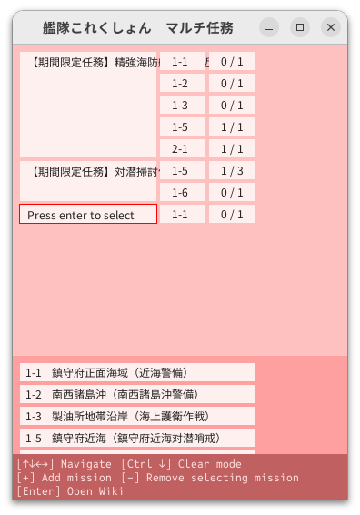
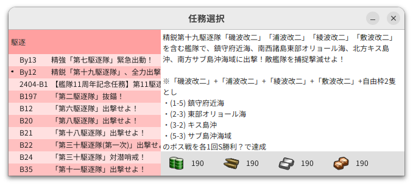

# 艦これマルチ任務メモ帳

複数任務を受けた状態で、どの任務をどれくらい進んだのかを管理するたのめの簡易ツール。<br>
~~一日で作ったシングルファイルスパゲッティコードなので要注意。~~<br>
元々は Main.java という単一ファイルで完結していたが、だんだん規模が大きくなってしまっている状態。




## Prerequisite

- Java 17+

Tested in Ubuntu 23.10 / 22.04. Welcome to provide screenshots from Windows / MacOS.

## How to use

compile + packaging + execute jar<br>
(if you want to just try the application, run the command below)

```
make
```

compile + packaing only (and execute it later)

```
make compile package

java -jar kancolle-multi.jar
```


## Environment Variables

| Key                                             | Default Value when empty                                                                           | Description                    |
| ----------------------------------------------- | -------------------------------------------------------------------------------------------------- | ------------------------------ |
| PLUSLAKE_KANTAI_COLLECTION_WORKDIR              | ~/.pluslake/kankore/multithread/                                                                   | Home directory of this program |
| PLUSLAKE_KANTAI_COLLECTION_MISSION_DOWNLOAD_URL | https://raw.githubusercontent.com/PlusLake/kantai-collection-mulithread-mission/master/mission.tsv | Download link of mission data  |

## Memo / Other info

- Data will be saved when the Window is closed. (Force killing the Window will causes data lost)
- This repo is maintained by this two guy:
  - [@PlusLake](https://github.com/PlusLake)
  - [@PGKan](https://github.com/PGKan)

```
// Grab mission info from Wiki
// https://wikiwiki.jp/kancolle/%E4%BB%BB%E5%8B%99
let result = [...document.querySelectorAll("td")]
    .filter(td => td.innerText.startsWith("B"))
    .map(td => [td, td.nextSibling, td.nextSibling.nextSibling])
    .map(tds => tds.map(td => td.innerText.replaceAll("\n", "\\n")))
    .map(tds => { console.log(tds[2]); return tds })
    .map(tds => tds.join("\t"))
    .join("\n");
console.log(result);
```

```
// Grab 海域 info from Wiki
// https://wikiwiki.jp/kancolle/%E5%87%BA%E6%92%83
let result = [...document.querySelectorAll("tbody tr")]
    .filter(tr => tr.children.length > 2)
    .map(tr => tr.children)
    .map(tds => [tds[0].innerText, tds[3].innerText].join("\t"))
    .join("\n");
console.log(result);
```
