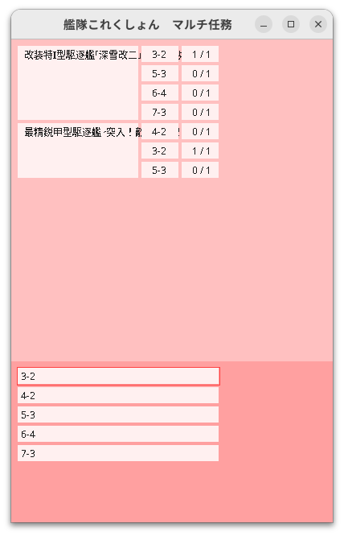

# 艦これマルチ任務メモ帳

複数任務を受けた状態で、どの任務をどれくらい進んだのかを管理するたのめの簡易ツール。 
一日で作ったシングルファイルスパゲッティコードなので要注意。

## Prerequisite

- Java 21+

Only tested in Ubuntu 23.04

## Key bindings

Work in process.
This application only uses those key below:
- Arrow Keys
- Add/Subtract Keys (+- in Numpad)
- Ctrl + Arrow Keys
- Escape
- Enter

## Environment Variables

| Key                                             | Default Value when empty                                                                           | Description                    |
| ----------------------------------------------- | -------------------------------------------------------------------------------------------------- | ------------------------------ |
| PLUSLAKE_KANTAI_COLLECTION_WORKDIR              | ~/.pluslake/kankore/multithread/                                                                   | Home directory of this program |
| PLUSLAKE_KANTAI_COLLECTION_MISSION_DOWNLOAD_URL | https://raw.githubusercontent.com/PlusLake/kantai-collection-mulithread-mission/master/mission.tsv | Download link of mission data  |
